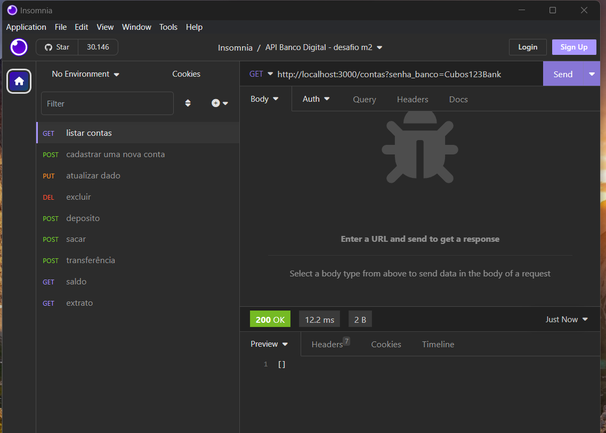

# API Banco Digital 💸

 

## Sobre o projeto

Bem-vindo ao repositório da API de um Banco Digital! Este projeto consiste em uma API RESTful desenvolvida para gerenciar operações bancárias básicas, proporcionando a criação, atualização e consulta de contas bancárias, além de permitir depósitos, saques, transferências e emissão de extratos.
Foi feita para o desafio do segundo módulo do curso da Cubos Academy, com foco no desenvolvimento back-end.
 

## Funcionalidades Principais ✍🏻
#### A API oferece as seguintes funcionalidades:

1 - Criar conta bancária: Crie uma nova conta bancária fornecendo informações essenciais do usuário.

2 - Listar contas bancárias: Obtenha uma lista de todas as contas bancárias registradas no sistema.

3 - Atualizar dados do usuário: Atualize os detalhes do usuário associado a uma conta bancária específica.

4 - Excluir conta bancária: Remova uma conta bancária e todas as suas informações associadas.

5 - Depositar em conta bancária: Realize um depósito em uma conta bancária específica.

6 - Sacar de conta bancária: Efetue um saque de uma conta bancária específica.

7 - Transferir valores: Transfira valores entre contas bancárias.

8 - Consultar saldo: Obtenha o saldo atual de uma conta bancária específica.

9 - Emitir extrato bancário: Receba um extrato detalhado das transações de uma conta bancária.
 

## Como Executar o Código e Testar as Requisições usando Insomnia 🔄
Siga estas etapas para executar o código deste projeto em sua máquina local e testar as requisições utilizando o Insomnia:

1 - Clone o Repositório: Abra o terminal e execute o seguinte comando para clonar o repositório em sua máquina:

-  git clone https://github.com/seu-usuario/banco-digital-api.git
cd banco-digital-api  //exemplo

2 - Instale as Dependências: No diretório do projeto, instale as dependências necessárias utilizando o seguinte comando:

-  npm install  

3 - Baixe e Instale o Insomnia: Se você ainda não possui o Insomnia, baixe e instale-o a partir do site oficial: Insomnia.

- Abra o Insomnia: Abra o Insomnia em seu computador.

- Importe a Coleção de Requisições: No Insomnia, importe a coleção de requisições que esta disponível junto do projeto. Essa coleção contém as requisições de exemplo para cada funcionalidade da API.

4 - Teste as Requisições: Utilize as requisições da coleção importada para testar cada funcionalidade da API. 

5 - Ficando assim o Insomnia

 

## Tecnologias Utilizadas 🤔

 
  
   
   
   
   

 
 

## Um pouco sobre o que cada tecnologia faz nesse projeto 👀
Neste projeto, diferentes tecnologias são empregadas para fornecer uma solução completa e funcional para o gerenciamento de operações bancárias. Aqui está uma breve explicação sobre o papel de cada tecnologia:

- JavaScript: Como a linguagem de programação principal, o JavaScript permite a criação de lógica de negócios, controle de fluxo e interações em todo o código do projeto.

- Node.js: O ambiente de tempo de execução do Node.js torna possível a execução de código JavaScript no servidor, permitindo a criação de uma API robusta e escalável.

- Express: O framework Express simplifica a criação de APIs RESTful. Ele lida com roteamento, middlewares e manipulação de requisições e respostas, agilizando o desenvolvimento da API.

- Nodemon: Nodemon é uma ferramenta de desenvolvimento que monitora as mudanças no código-fonte. Isso acelera o ciclo de desenvolvimento, pois o servidor é automaticamente reiniciado sempre que há alterações.

- NPM (Node Package Manager): O gerenciador de pacotes NPM facilita a gestão das dependências do projeto. Ele permite a instalação e atualização de bibliotecas externas necessárias para o funcionamento da aplicação.

- Cada uma dessas tecnologias desempenha um papel fundamental na construção e no funcionamento do projeto, contribuindo para uma experiência de usuário fluida e para a eficiência do sistema como um todo.

## Status do projeto

✅ Concluído

 

##### Feito por mim, Gleicy 👩🏻‍💻